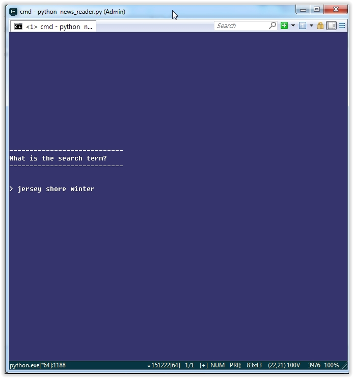
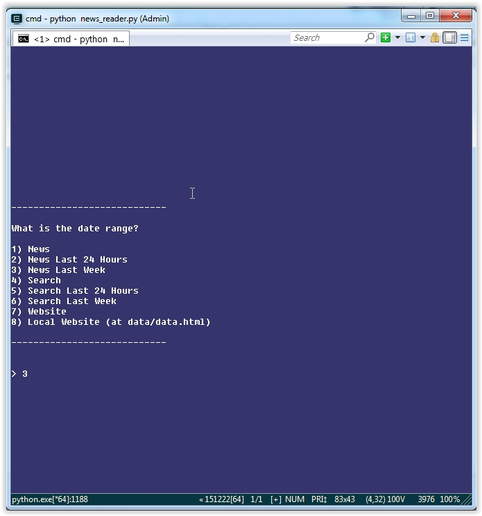
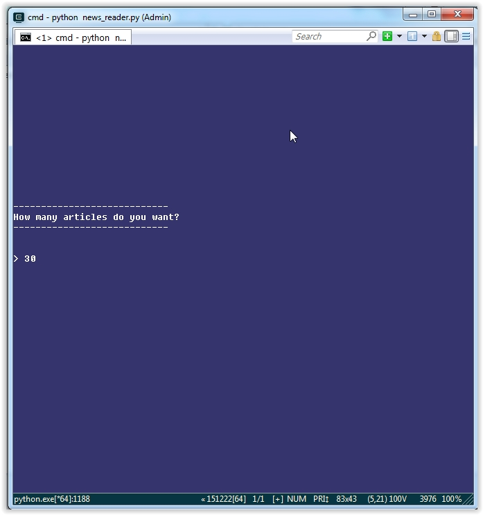
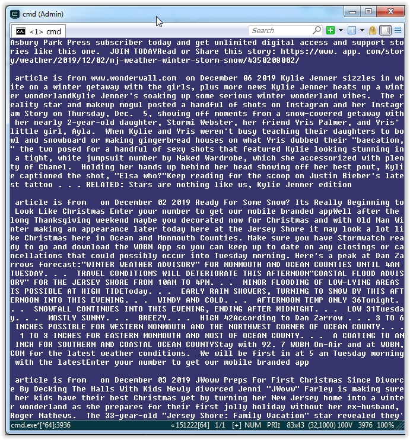

# News Aggregator

It has been a very long time I last used this. This collects news articles (I now exclusively read computer books so I don't have much use for this anymore)

This will collect many articles all over the internet, and use Asyncio to asynchronously get the text inside of articles.

This also uses the amazing newspaper module in Python to extract the text itself. Asyncio/Newspaper is combined into a user interface to make it do what I want. This was a way for me to practice Asyncio & Asynchronous Programming in Python (and not Javascript for a change, and to solve a use case for me back at the time)

Your options for searching in the news are the following:

> Google News 
> Google News Last 24 Hours 
> Google News Last Week
> Google Search
> Google Search Last 24 Hours
> Google Search Last Week
> Website (ANY news website like www.jerseyshoreonline.com OR ww.seattletimes.com)
> Local Website (at data/data.html)

Unlike my older programs, this time I used classes to neatly separate functionality among the options above. I should have used the state design pattern for the menu (Hint: I did in subsequent programs after this)

If you are someone who likes to get multiple articles all at once (after answering some questions) and put this in a Kindle (or Audiobook format), this program is for you!

